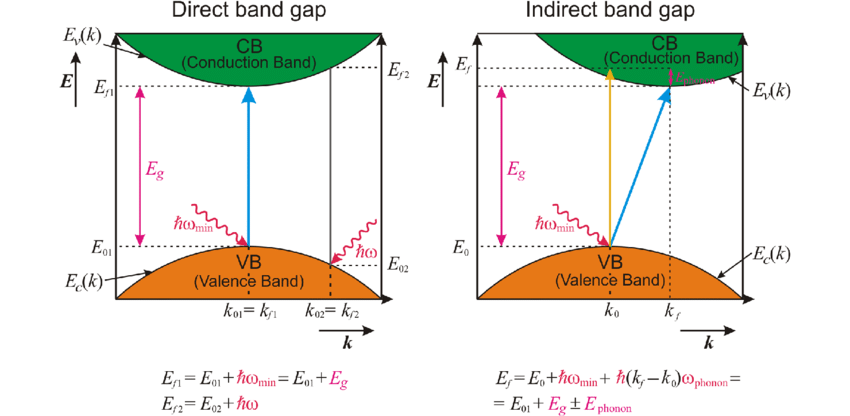
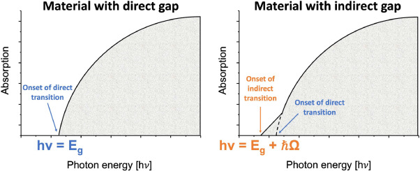

## Topic Description  
Photon–semiconductor interactions form the basis of optoelectronic devices such as LEDs, lasers, and solar cells. These interactions involve:  

- **Photon absorption** (generation of electron–hole pairs)  
- **Recombination** (radiative or non-radiative emission)  
- Dependence of these processes on the **bandgap type** of the semiconductor  

- **Absorption**: Photons with energy greater than or equal to the bandgap  
  $$ h\nu \geq E_g $$  
  can excite electrons from the valence band to the conduction band.  

- **Emission**: Excited carriers recombine to release energy either as light (luminescence) or heat (non-radiative).  

- **Direct vs. Indirect bandgap**: Determines whether recombination is efficient (direct) or phonon-assisted (indirect).  

 

---

## Photon Absorption  

The absorption coefficient $ \alpha(h\nu) $ describes how strongly a material absorbs light of photon energy $ h\nu $:  

$$ I(x) = I_0 e^{-\alpha x} \tag{5.11.1} $$  

- For **direct bandgap semiconductors** (e.g., GaAs):  

$$ \alpha(h\nu) \propto (h\nu - E_g) \tag{5.11.2} $$  

- For **indirect bandgap semiconductors** (e.g., Si):  

$$ \alpha(h\nu) \propto (h\nu - E_g \pm E_{ph})^2 \tag{5.11.3} $$  

where $E_{ph}$ is the phonon energy.  

 
---

## Emission Processes  

When carriers recombine, photons may be emitted:  

- **Spontaneous Emission (Luminescence):** Random photon emission after recombination.  
- **Stimulated Emission:** An incoming photon triggers emission of another photon with identical phase, direction, and energy — foundation of lasers.  

### Types of Luminescence  
- **Fluorescence:** Short carrier lifetime ($\sim$ ns).  
- **Phosphorescence:** Long carrier lifetime ($\sim$ µs–ms).  

---

## Light Amplification and Laser Action  

Under **population inversion**, stimulated emission dominates over absorption, leading to light amplification.  

Laser operation requires:  
1. Population inversion  
2. Optical feedback (cavity resonance)  
3. Gain exceeding losses  

---

## Key Equations  

Absorption law:  
$$ I(x) = I_0 e^{-\alpha x} \tag{5.11.4} $$  

Direct bandgap absorption:  
$$ \alpha(h\nu) \propto (h\nu - E_g) \tag{5.11.5} $$  

Indirect bandgap absorption:  
$$ \alpha(h\nu) \propto (h\nu - E_g \pm E_{ph})^2 \tag{5.11.6} $$  

Spontaneous recombination rate:  
$$ R_{\text{spontaneous}} \propto np \tag{5.11.7} $$  

Stimulated recombination rate:  
$$ R_{\text{stimulated}} \propto B_{21}\,\rho(h\nu) \tag{5.11.8} $$  

Optical gain:  
$$ G = \sigma_{\text{stim}} (N_2 - N_1) \tag{5.11.9} $$  

---
